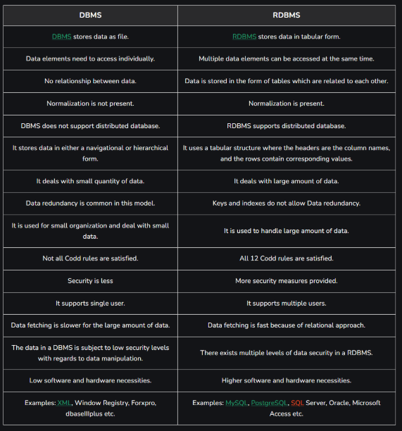
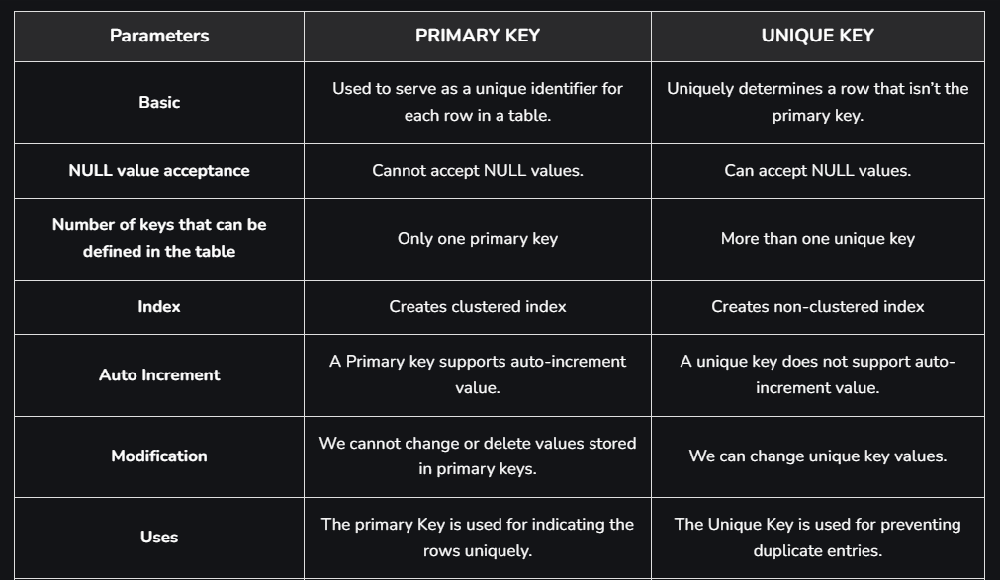
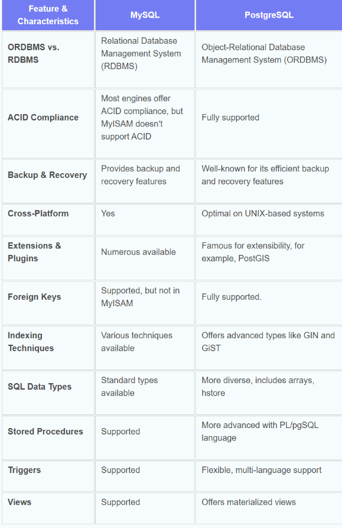
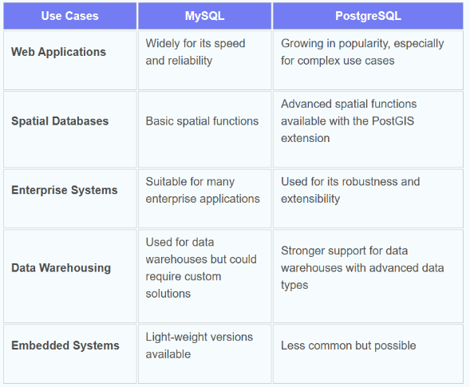
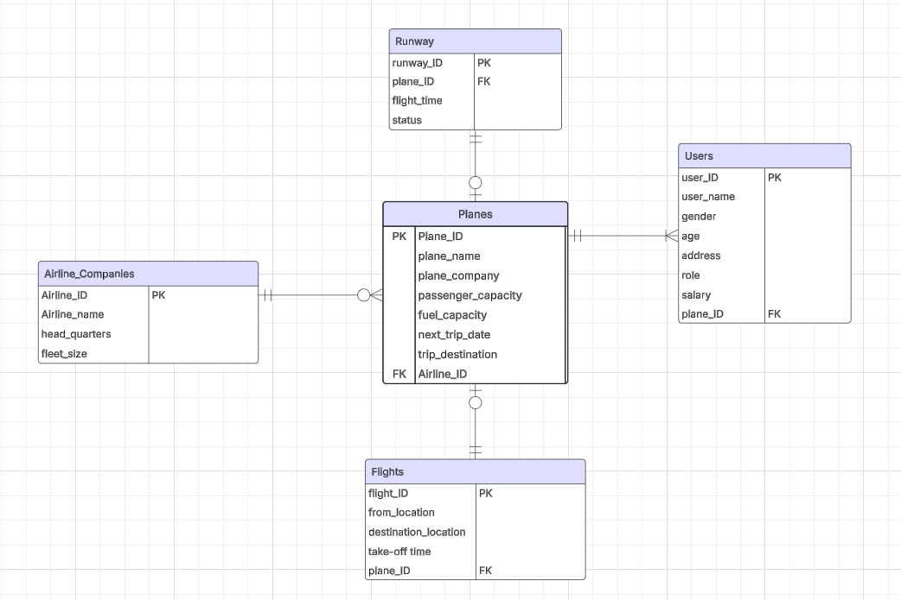

# Reaserch

this is the file that will contain all the reaserch throughout the MySQL journey, ihope you enjoy :-)

## task 1

- **"What is Database and why does it exist?":**

  when we think of what is a Database the first thing that comes to mind is information, it is basically a place to store any kind of information, maintaining it, and accessing it.

  > Databases are structured collections of data organized into tables, rows, and columns. Databases serve as repositories for storing information efficiently and provide a way to manage and access data.

  --w3school

  they are vital so we can store data from different kinds, data for organizations or such, so that important data, lets say like customer data, product data, and other stuff for an e-commerce website for example are kept in a safe place, so that it can be accessed and have operations done upon them using different dbms's.

- **"What is the SQL?":**

  SQL (or Structured Query Language) is a programing language that is standardized for managing and manipulating relational databases so basically we can't think of a database without thinking of SQL. with SQL you can do all kinds of operations on a database, weather it's just retrieving it's content, or changing it in some type of way

- **"What is the history of MySQL?":**

  MySQL was founded by Swedes David Axmark and Allan Larsson, along with Finnish Michael "Monty" Widenius by a Swedish company called "MySQL AB". Developement for it began in 1994 and by 23rd of may 1995 the first version released it was created for personal use rather than mSQL which was considered slow and inflexable by them(MySQL AB) at the time, creating a new interface while still keeping the same API as mSQL, this of course allowed developers to migrate to MySQL easier. from the day it released to this day the developers keep on improving upon MySQL and in 2019 MySQL was declared DBMS of the year by DB-Engines ranking, proving its worth in managing databases

- **"What are the most 5 famous DBs in the world now?and why?":**

there are many rankings to differant db's but here is what i found to be the most fitting by [swhosting.com](https://www.swhosting.com/en/blog/the-5-most-widely-used-databases-worldwide-which-is-the-best-choice-for-my-project)

1. **Oracle:**
   it is one of the oldest and most used relational databases in the business world, it is well known to be highly scalable, secure and reliable so it's no wonder for it being popular among large enterprises and governments, it has all the basic data management features along side the richest features for data security

2. **MySQL:**
   MySQL's popularity stems mainly from it being open-source and having high performance,reliability and ease of use, we can see MySQL in popular web apps like Facebook and X.com (twitter, before elon musk ruined everything(as if it wasn't ruined already))and Youtube.

3. **Microsoft SQL Server:**
   mainly popular due to it"s integration of other microsoft tools like .NET framework and VS, it has many advanced features that make it standout from other db's

4. **PostgreSQL:**
   this is another open-source RDB it has earned a strong reputation for its achtecture, reliability, data integrity and many more. It comes with many features aimed to help developers build applications, administrators to protect data integrity and build fault-tolerant environments, and help you manage your data no matter how big or small the dataset.

5. **MongoDB:**
   a document oriented NoSQL database that became popular among web and mobile app development, it stands out from other RDB's for it's use of the flexable JSON documents which facilitates scalability and adaptability to changes in the data schema

**Sources**

- [What is a database (DB)? | Definition from TechTarget](https://www.techtarget.com/searchdatamanagement/definition/database#:~:text=Computer%20databases%20typically%20store%20aggregations,accessing%20any%20sort%20of%20data.)

- [What is SQL?](https://www.geeksforgeeks.org/what-is-sql/)

- [MySQL - Wikipedia](https://en.wikipedia.org/wiki/MySQL#:~:text=MySQL%20was%20created%20by%20a,appeared%20on%2023%20May%201995.)

- [Oracle Database - An Introduction](https://www.geeksforgeeks.org/oracle-database-an-introduction/)

- [What is PostgreSQL?](https://www.postgresql.org/about/)

- [MongoDB](https://en.wikipedia.org/wiki/MongoDB)

## task2

- **"What is RDBMS?":**

  this really doesn't need a lot of explaination as we are using one right now to solve the tasks which is MySQL, basically it's the collection of programs and capabilities used to enable us to enteract with relational databases being editing it updating it or even creating it (relational databases is a type of database that stores data related to each other)

- **RDBMS VS DBMS:**
  as we can figure from it's name, a Database Management system or DBMS for short is a system that is used to manage the flow of the data as it goes in in the database

  > Database management system, as the name suggests, is a management system that is used to manage the entire flow of data, i.e, the insertion of data or the retrieval of data, how the data is inserted into the database, or how fast the data should be retrieved, so DBMS takes care of all these features, as it maintains the uniformity of the database as well does the faster insertions as well as retrievals.

  --w3school

  Relational Database Management Systems though as the name suggests too deals with the relations of the data to eachother, having schemas and tuples to help arrange data and in the proccess reducing data redundancy.
  

- **Naming conventions:**
  it's a set of rules that should be upplied when choosing chrachter sequences, basically the way you want to name things and how they should look being unified, let's say when working on a project with a team or so, to make things easier to understand and much more readable.
  let's take Multiple word identifiers as an example, lets say you are programing with c++ (or like 99% of programing languages) there will come times where you want to name a variable with two words rather than one to make things easier to understand let's take "Employee id" as an example, in c++, those two words cant be seperated by a space, so without altring the way we right it would look somthing like "employeeid" which might be hard to read and understand so other developers when they look through the code they might get a little confused whlie navagating it, so it's best practice to change the way you write them using ways like: camelCase, snake_case, camel_Snake_Case, kebab-case, Train-Case, and many more (p.s the way of typing two words like "employeeid" in this way is called **"flatcase"** which is highly advisable to avoid while choosing the rules for writing characters).

**Sources**

- [What is data management and why is it important? Full guide](https://www.techtarget.com/searchdatamanagement/definition/RDBMS-relational-database-management-system)

- [Difference Between RDBMS and DBMS](http://geeksforgeeks.org/difference-between-rdbms-and-dbms/)

- [Naming convention (programming)](<https://en.wikipedia.org/wiki/Naming_convention_(programming)>)

## task 3

- **primary keys vs unique keys:**

  **primary keys**: these are keys that identify each row in the table and their value can never be duplicate nor null as with this unique value as i said the row is identified

  **unique keys**: these however are as the name suggests values that are unique to each row, not necessarily used as an identifier for the row but it's a value that must be differant from one row to the other, and it can have one null value

  **a table can have multiple unique keys but only one primary key**

  for a better comparisson:

  

- **constraints in MySQL:**

  used to specify rules to controll what value will be stored in the table, these help ensure data accuracy and integrity, these come in handy when you want to store the data in a certain type of way or restricting other ways of storing

  and there are **two** types:

  **Column Level Constraints:** These constraints are applied only to the single column that limits the type of particular column data.

  **Table Level Constraints:** These constraints are applied to the entire table that limits the type of data for the whole table.

  for example we have: NOT NULL, UNIQUE, DEFAULT

  **NOT NULL** is used to prevent null or empty data from being stored in the column

  **UNIQUE** is used to prevent duplicate values in a single column

  **DEFAULT** is used to store a specified default value if a value was not stored in a column

- **indexing in MySQL:**

  Indexes are used to find rows with specific column values quickly. Without an index, MySQL must begin with the first row and then read through the entire table to find the relevant rows. The larger the table, the more this costs

  > An index is a data structure that improves the speed of operations on a database table. They are a special type of lookup tables pointing to the data.

  --Tutorialspoint

  **Types of MySQL Indexes**

  - Simple Index

  - Unique Index

  - Primary Key Index

  - Fulltext Index

  - Descending Index

  in short, think of indexing as a way to make accessing rows much easier and less costly by accessing the row directly through certain indexes

- **Difference between MySQL and Postgresql**

  both offer many of the same features and differences cant really be noticed on the surface level, diving more deeper however and working on huge projects with them is where we can start to see stuff:

  MySQL is preferred for managing read-only commands. It is not preferred when concurrency is required.

  PostgreSQL is preferred for managing read-write operations, large datasets, and complex queries. But it’s not preferred for read-only operations.

  MySQL offers fewer features than PostgreSQL, but this allows MySQL to stay lighter, more stable, and faster at processing—especially when it comes to read-only queries.

  PostgreSQL was built to be ACID-compliant from the ground up and it’s optimal when concurrent transactions (MVCC) are required, but it is slower and less stable when it comes to read-only operations.

  MySQL is highly compatible with many different types of data storage engines. Whereas PostgreSQL is highly compatible with many different NoSQL formats.

  here are some features to see if one or both support them:

  

  and these are some use cases with a suggestion for which one is better as an option:

  

**Sources**

- [Difference between Primary key and Unique key](https://www.geeksforgeeks.org/difference-between-primary-key-and-unique-key/)

- [MySQL Constraints](https://www.tpointtech.com/mysql-constraints)

- [MySQL - INDEXES](https://www.tutorialspoint.com/mysql/mysql-indexes.htm)

- [PostgreSQL vs MySQL: The Critical Differences - Integrate.io](https://www.integrate.io/blog/postgresql-vs-mysql-which-one-is-better-for-your-use-case/#:~:text=PostgreSQL%20is%20preferred%20for%20managing,comes%20to%20read%2Donly%20queries.)

## task 4

- **Relations (one to one, one to many, many to many):**

  they define how tables are connected to each other, having relations essentially helps orgnize the data across multiple tables which can result in efficient data retrival and maintenance

  lets get to the types

  - **One-to-One:** Each record in Table A is associated with one and only one record in Table B, and vice versa, for example we can have a user table and a user_profiles table: the relation between those tables is that a user in the user table has only one profile in the user_profile table both being linked with what is called "foreign key" being in one table and refrencing a primary key in the other

  - **One-to-Many:** Each record in Table A can be associated with multiple records in Table B, but each record in Table B is associated with only one record in Table A, and if we apply that logic to the last example we can figure that a user from the user table can be linked to multiple profiles in the user_profile table but the same cant be said to the profiles as it can only be linked to one user(there is another type called many to one but it's basically the same comcept but flipped so i won't bother in explaining it)

  - **Many-to-Many**: Each record in Table A can be associated with multiple records in Table B, and vice versa, for this let's consider three tables a table for students and their info, a table for courses and their info, and lastly one called student_courses where it links multiple students to multiple courses from their corresponding tables as a student can enroll in multiple courses and a course can be assigned to multiple students

- **Write-ahead logging:**

  this is a method to basically insure data reliability and integrity, and the core concept for it is to write the changes in a log before actually commiting them to the datafiles, this can help in case of disasters occuring where data can be damaged where we can replay the logs to return it to it's last state, this concept is applyed to a lot of bussinesses and not just data oriented bussinesses.

- **What are normalization and denormalization and their differences:**

  Normalization and denormalization are two key concepts in database design, each serving a specific purpose,The goal of normalization is to minimize data redundancy and dependency by organizing data into well-structured tables, on the other hand Denormalization involves combining tables that have been normalized to improve query performance and simplify data retrieval and the choice to chose between those differs on the requirements for the data

  benefits for normalization include:

  - Reduced redundancy: Normalization minimizes data duplication by storing information only once. This reduces storage requirements and improves efficiency.

  - Improved data integrity: By eliminating anomalies such as insertion, update, and deletion anomalies, normalized data ensures that the database remains accurate and consistent.

  - Enhanced consistency: Normalization enforces consistency in data representation across tables, leading to a more coherent and standardized database structure.

  - Easier updates: Updates to the database are simplified because changes only need to be made in one place. This reduces the likelihood of inconsistencies arising from incomplete or conflicting updates.

  - Simplified querying: Queries become more straightforward and efficient as data is organized logically into related tables, allowing for easier retrieval of specific information.

  benefits for denormalization include:

  - Optimized data retrieval: Denormalization aims to improve query performance by minimizing the number of joins needed to retrieve data. This is particularly beneficial in situations where complex queries are executed frequently.

  - Simplified data analysis: Analytical tasks and reporting can be simplified with denormalized data because all relevant information is stored in one place. This makes it easier to generate reports and perform data analysis without the complexity of navigating through multiple tables.

**Sources**

- [Denormalized vs. Normalized Data - Pure Storage Blog](https://blog.purestorage.com/purely-educational/denormalized-vs-normalized-data/#:~:text=The%20goal%20of%20normalization%20is,performance%20and%20simplify%20data%20retrieval.)

- [How does the database guarantee reliability using write-ahead logging?](https://www.youtube.com/watch?v=wI4hKwl1Cn4&t=97s)

- [What Write Ahead Logging Is and Why It Matters](https://www.sqlservercentral.com/editorials/what-write-ahead-logging-is-and-why-it-matters)

- [Relationships in SQL - One-to-One, One-to-Many, Many-to-Many.](https://www.geeksforgeeks.org/relationships-in-sql-one-to-one-one-to-many-many-to-many/)

**Project erd:**

**task 5**

- **Multi-version concurrency Control**

  Multi-Version Concurrency Control is a technology, utilized to enhance databases by resolving concurrency problems and also data locking by preserving older database versions. When many tasks attempt to update the same piece of data simultaneously, MVCC causes a conflict and necessitates a retry from one or more of the processes.

  - Timestamp-based MVCC: The data visibility to transactions is defined by the unique timestamp assigned to each transaction that creates a new version of a record.
  - Snapshot-based MVCC: This utilizes the database snapshot that is created at the beginning of a transaction to supply the information that is needed for the transaction.
  - History-based MVCC: This Keeps track of every modification made to a record, making transaction rollbacks simple.
  - Hybrid MVCC: This coordinates data flexibility and performance by combining two or more MVCC approaches

- **Triggers**

  SQL triggers are a critical feature in database management systems (DBMS) that provide automatic execution of a set of SQL statements when specific database events, such as INSERT, UPDATE, or DELETE operations, occur. Triggers are commonly used to maintain data integrity, track changes, and enforce business rules automatically, without needing manual input.

- **How can you take the backup of a database?:**

  using the BACKUP DATABASE in sql (not sure if this is what the question asks but this is all i can find :-] )

**Sources**

- [What is Multi-Version Concurrency Control (MVCC) in DBMS?](https://www.geeksforgeeks.org/what-is-multi-version-concurrency-control-mvcc-in-dbms/)
- [SQL Trigger](https://www.geeksforgeeks.org/sql-trigger-student-database/)
- [SQL BACKUP DATABASE for SQL Server](https://www.w3schools.com/sql/sql_backup_db.asp)
